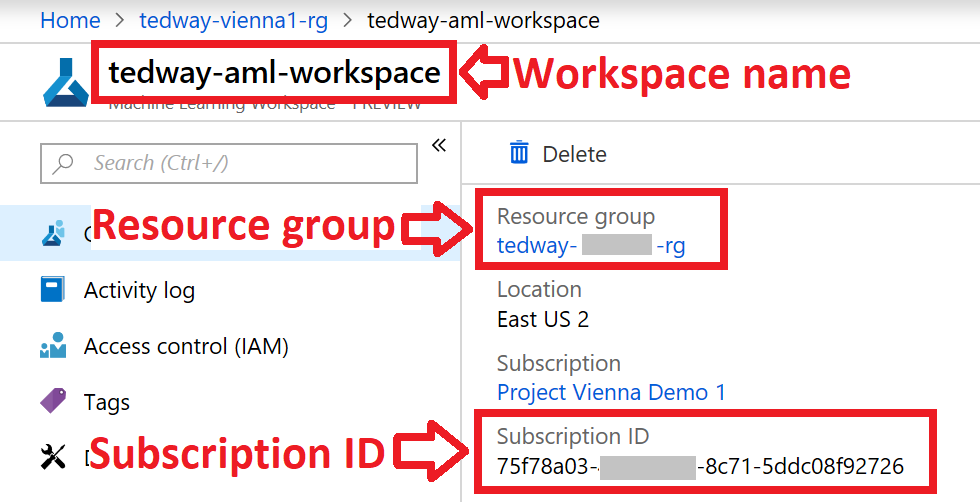

# Docs

## Set Up Environment
Follow the instructions in the 00.configuration.ipynb notebook in the [Azure ML MachineLearningNotebooks](https://aka.ms/aml-notebooks) repo.

   **IMPORTANT:** For location, you MUST choose **East US 2** as the region.

You will create an Azure Machine Learning Workspace, which is required to deploy hardware-accelerated models.  If you have an existing workspace in the Azure **East US 2** region, you may skip this step.

## Get Workspace Information
When you are asked for information about your workspace for the quota request form you will need these items:
1. Subscription ID (GUID)
1. Resource group name
1. Workspace name

 

